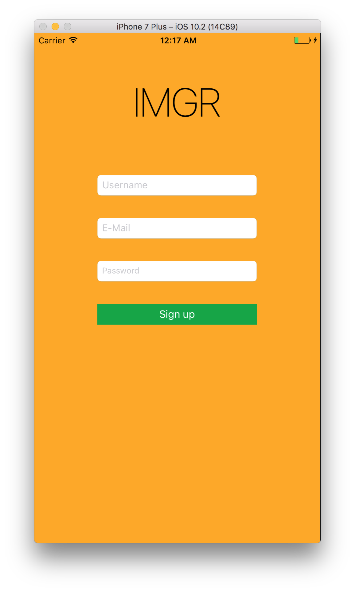

Readme for IMGR
===================

Thanks for looking at IMGR, a good solution for browsing pictures on your mobile device. IMGR is connected to the [Pixabay](https://pixabay.com) API, this API is used to provided the images. In IMGR it is also possible to find your friends and see what their favorite pictures are.

Possibilities
-------------

Start by signing up

Search for cool foto's  

  
View them and add to your favorites

Browse through your favorites

Find your friends and see what their favorite pictures are

When you don't want your friends to see your pictures, simply flip the switch

Two test accounts are available:
  test1 -> test1@thomaskamps.nl, wachtwoord: testtest1
  test2 -> test2@thomaskamps.nl, wachtwoord: testtest2
Please try and add them as your friends :)
